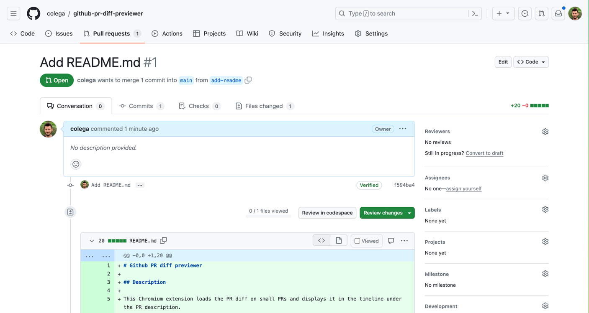

# Github PR diff previewer

## Description

This Chromium extension loads the PR diff on small PRs and displays it in the timeline under the PR description.

This allows reviewing, approving and merging without having to switch to the diff tab, which is usually very slow to load.

## Functionality

Diffs with less than 50 lines changed will be loaded and displayed in the timeline automatically. 
Diffs longer than 50 lines can be loaded by clicking on the "Diff stat" indicator on the top right corner (that shows the number of lines added and removed).

## Caveats

Works only on fresh load of the PR page. If you navigate from a different Github page, the PR is loaded without reloading the entire page and it won't work (PRs are accepted!).

## Installation

Currently not published in the Chrome store, so you need to enable the developer mode in your Chromium based browser and click on the "Load unpacked extension" button. 